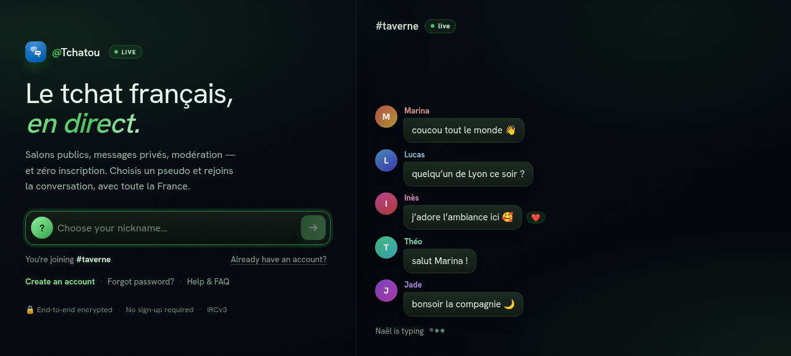

<div align="center">


# Orbit

**A modern, pluggable IRCv3 web client.**
TypeScript · React · Vite · zustand — installable as a PWA, re-brandable without a rebuild.

[](#-status)
[](./LICENSE)
[](https://ircv3.net/)
[](#-features)
[](#)
[](#-internationalization)

[**Live demo**](https://tchatou.fr/app/) · [**Project page**](https://orbit.tchatou.fr) · [**Configuration**](./CONFIG.md) · [**License**](./LICENSE)



</div>

---

Orbit is a bespoke IRCv3 web client built from scratch — no wrappers, no bridge. It
speaks modern IRCv3 directly over a WebSocket and presents it as a polished,
app-like chat experience: rich messages, reactions, replies, history, web push,
themes and full internationalization. It powers [tchatou.fr](https://tchatou.fr)
in production and can be re-pointed at **any** IRCv3 network and fully re-branded
by editing a single runtime `config.json` — no rebuild required.

## 🚧 Status

> **Work in progress.** Orbit is under active development. It runs in production,
> but the UI, config keys and internal APIs are still evolving and may change
> without notice between commits. Bug reports and contributions are welcome.

## ✨ Features

- **Real IRCv3** — negotiates [25 capabilities](#-ircv3-capabilities): chat history,
  message redaction (edit/delete), multiline, reactions, replies, account
  registration &amp; SASL, server-time, away/typing, web push, and more.
- **Rich composer** — bold/italic/underline + mIRC colours, emoji picker,
  `:emoji:` / `@nick` / `/command` tab-completion, multiline, image upload
  (paste & drag-drop), and per-channel drafts.
- **Conversations** — channels & DMs, member list with roles, whois/profile
  panels, friends with online alerts, channel admin (modes, bans, topic),
  link/image/YouTube unfurling.
- **Installable PWA** — offline app shell via a service worker, plus **Web Push**
  notifications (RFC 8291 / VAPID) that work even when the app is closed.
- **Themes** — Light, Dark, Orbit, Orbit Dark and a classic yomIRC/IRC mode.
- **Settings that surface the protocol** — a live **Server** panel (network,
  software, TLS, users, limits, raw ISUPPORT) and an **IRCv3** panel showing
  exactly which capabilities your server supports.
- **Fully internationalized** — 10 languages, browser-detected and switchable
  live (see [Internationalization](#-internationalization)).
- **Plugins** — an experimental, operator-controlled plugin API (`window.Orbit`)
  for events, IRC actions, theming and UI slots. See
  [docs/PLUGINS.md](./docs/PLUGINS.md).

## 🔌 IRCv3 capabilities

Orbit requests every capability it knows how to use and lights up a live status
panel (Settings → IRCv3) showing what the connected server actually supports.
The full set it negotiates lives in [`src/irc/caps.ts`](./src/irc/caps.ts) —
including `draft/chathistory`, `draft/event-playback`, `draft/message-redaction`,
`draft/multiline`, `draft/account-registration`, `draft/webpush`, `sasl`,
`server-time`, `message-tags`, `echo-message`, `batch`, `labeled-response`,
`multi-prefix`, `away-notify`, `chghost`, and more.

## 🚀 Quick start

Requirements: **Node 20+** and npm.

```bash
npm install
npm run dev        # Vite dev server with HMR
npm run build      # type-check (tsc -b) + production build → dist/
npm run preview    # serve the production build locally
npm run lint       # ESLint
npm run test       # Vitest
```

## ⚙️ Configuration

Orbit is configured at **runtime** by `config.json`, fetched on
startup and deep-merged over built-in defaults. Point it at another IRC network
and fully re-brand it **without rebuilding** — just edit the deployed file and
reload (the service worker serves it network-first).

→ **See [CONFIG.md](./CONFIG.md)** for every option, merge rules, and examples.

```jsonc
{
  "server":   { "url": "wss://irc.example.org/ws/" },
  "startup":  { "channels": ["#lobby", "#help"] },
  "branding": { "name": "ExampleChat", "url": "https://example.org" }
}
```

## 📦 Deployment

Static output — copy `dist/*` (including `config.json`) to the web root served at
`/app/`. To change only the config later, edit the deployed `/app/config.json`
and reload. Full steps in [CONFIG.md → Deploy](./CONFIG.md#deploy).

## 🗂️ Project structure

```
src/
  irc/         IRCv3 client, parser, capabilities, numerics, modes
  store.ts     zustand store — connection, buffers, messages, actions
  components/  chat UI (sidebar, composer, message list, members, modals…)
  i18n/        react-i18next setup + 10 locale files
  ui/ lib/     theming, formatting, editor helpers
public/        config.json, icons, manifest, service worker
```

## 🌍 Internationalization

Every user-facing string is translated across **10 languages** — English,
French, German, Spanish, Italian, Portuguese (Portugal & Brazil), Russian,
Turkish and Nepali. The language is browser-detected, persisted, and switchable
live from Settings. Strings live in [`src/i18n/locales/`](./src/i18n/locales).

## 🧪 Development & CI

A [Woodpecker CI](https://ci.codeberg.org) pipeline ([`.woodpecker.yml`](./.woodpecker.yml))
runs **lint + test + build** on every push and pull request once the repository
is enabled at [ci.codeberg.org](https://ci.codeberg.org).

## 📄 License

Licensed under the **GNU Affero General Public License v3.0 or later**
(AGPL-3.0). If you run a modified version of Orbit as a network service, you must
make your modified source available to its users. See [LICENSE](./LICENSE).

<div align="center"><sub>Built with React · Cutting Edge IRCv3 cap- <a href="https://orbit.tchatou.fr">orbit.tchatou.fr</a></sub></div>
